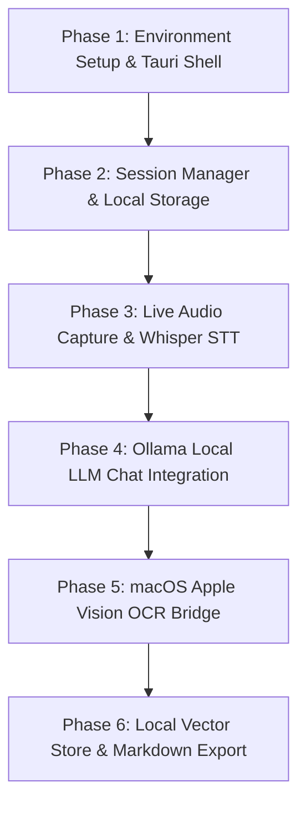

# Implementation Plan - Atlas AI Desktop (Test MVP)

An analysis and technical implementation plan for **Atlas AI Desktop**, a lightweight, local-first macOS desktop application for audio session recording, real-time transcription, screen region OCR, and local AI assistant chat.

---

## 1. Executive Summary & Architecture Overview

**Atlas AI Desktop** is a zero-cloud, privacy-first native macOS application that captures session audio, transcribes it locally in real time, allows region-based screen OCR, and enables context-aware chat via a local LLM runtime.

### Core Stack
- **Native Shell:** Tauri 2.0 (Rust core + native macOS WebView)
- **Frontend:** React 18 + TypeScript + Vite + Tailwind CSS
- **Speech-to-Text (STT):** `whisper.cpp` (C/C++ bindings in Rust, using `base.en` model)
- **Local LLM Engine:** Ollama local daemon (`llama3.2:3b` or `qwen2.5:3b`)
- **OCR Engine:** macOS native **Apple Vision framework** via Swift/Objective-C bridge (with Tesseract fallback)
- **Vector Search:** `all-MiniLM-L6-v2` embeddings stored in SQLite + `sqlite-vss`
- **Data Persistence:** Local JSON + Markdown per session stored under `~/Library/Application Support/atlas-ai/sessions/`

---

## 2. Environment & System Readiness

An initial environment audit revealed the current system setup:

| Dependency | Status | Action Required |
| :--- | :--- | :--- |
| **Node.js / npm** | ✅ Installed (`/usr/local/bin/node`) | Ready |
| **Rust / Cargo** | ❌ Missing | Install via `sh.rustup.rs` |
| **Tauri CLI** | ❌ Missing | Install via `cargo install tauri-cli` or `npm` |
| **Ollama** | ❌ Missing | Install via Homebrew (`brew install ollama`) and pull model |
| **Whisper.cpp / Core ML** | ❌ Missing | Build/install `whisper.cpp` engine |

---

## 3. Phased Implementation Roadmap

### Phase 1: Environment Setup & Project Scaffolding
- Install Rust compiler toolchain (`rustup`) and Tauri CLI.
- Scaffold Tauri project (`atlas-ai-desktop`) with React + TypeScript + Vite + Tailwind CSS.
- Configure `tauri.conf.json`, window management, permissions, and app icon.
- Verify native macOS `.app` build and launch capability.

### Phase 2: Session Management & UI Layout
- Build modern dark-themed React UI (Sidebar, Session Controller, Live Transcript View, Chat Panel, OCR Toolbar).
- Implement Rust commands for creating, starting, pausing, stopping, and saving session metadata (`metadata.json`).
- Ensure crash-safe local file persistence in `sessions/session_<timestamp>/`.

### Phase 3: Live Audio Capture & Speech-to-Text (`whisper.cpp`)
- Integrate Rust audio capture (via `cpal` crate or macOS native AVFoundation microphone input).
- Bind `whisper.cpp` with Apple Silicon Metal acceleration.
- Stream transcribed text chunks in real time over Tauri IPC events (`transcript-delta`) to React UI.

### Phase 4: Local AI Chat Engine (Ollama Integration)
- Ensure background communication with local Ollama service (`http://localhost:11434`).
- Feed current active transcript + notes into prompt context.
- Stream response tokens back to UI with `<2s` target latency.

### Phase 5: Screen-Region OCR (Apple Vision Framework Bridge)
- Implement screen region selection overlay in native macOS/React.
- Bridge Rust to macOS `VNRecognizeTextRequest` (Apple Vision Framework) for hardware-accelerated OCR.
- Append recognized screen text to session OCR log (`ocr.json`).

### Phase 6: Local Vector Search & Export
- Implement local embedding chunking (`all-MiniLM-L6-v2`).
- Store embeddings in SQLite with `sqlite-vss` extension.
- Build Markdown/TXT export generator for complete session summary bundle.

---

## 4. Key Open Decisions & Recommendations

> [!IMPORTANT]
> **Recommended Defaults for Test MVP:**
> 1. **LLM Model:** Use `llama3.2:3b` for ultra-fast response times (<1.5s on M-series Mac) and low RAM footprint.
> 2. **Whisper Model:** Default to `base.en` for instant streaming transcription, with option to switch to `small.en` in settings.
> 3. **Audio Scope:** Start with **Microphone Input** for Phase 1 MVP to avoid virtual audio driver setups (BlackHole/ScreenCaptureKit permissions).

---

## 5. Verification Plan

### Automated Verification
- Verify Rust project compiles cleanly: `cargo check` & `cargo test`.
- Verify TypeScript types & Vite frontend build: `npm run build`.
- Check Tauri native bundle: `npm run tauri build`.

### Manual Verification
- **App Launch:** Launch `.app` native window within <5 seconds.
- **Audio & STT:** Speak into mic, observe live streamed text in the transcript box.
- **AI Chat:** Ask a question regarding spoken transcript, verify response time <2 seconds.
- **OCR:** Drag box on screen, verify extracted text appears correctly.
